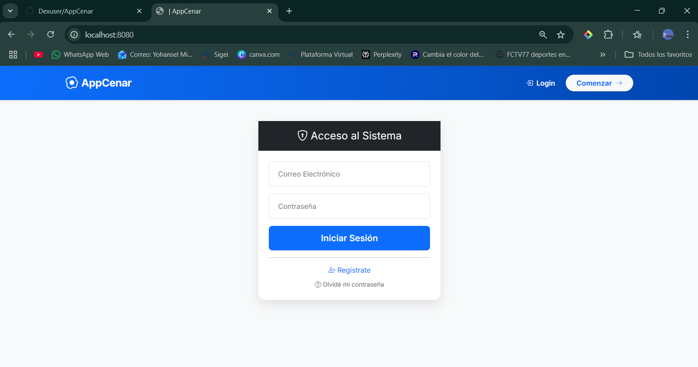
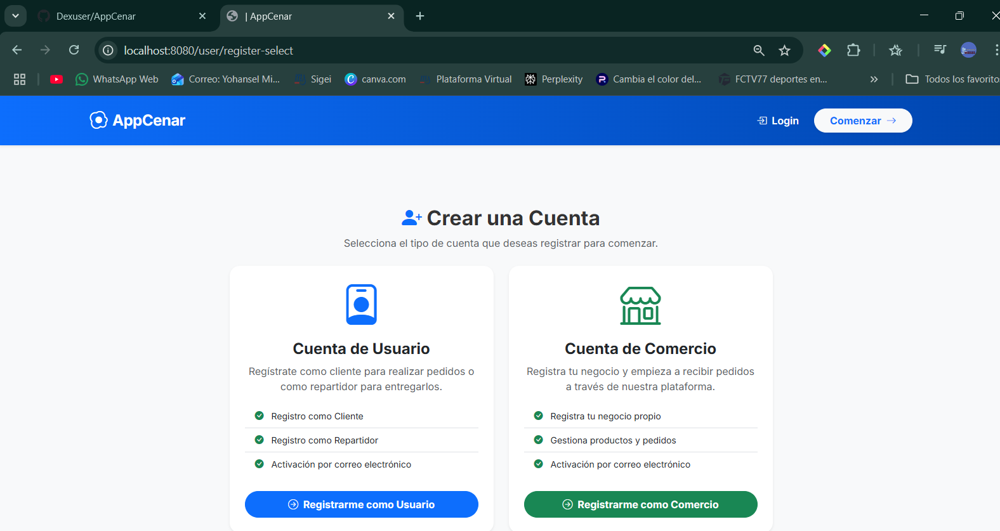
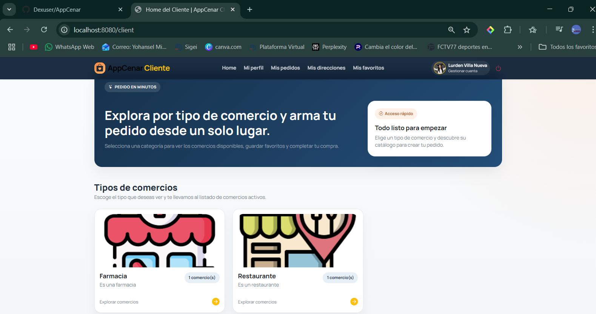
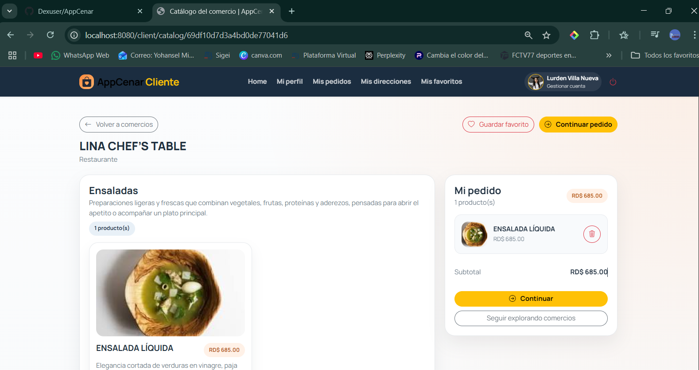
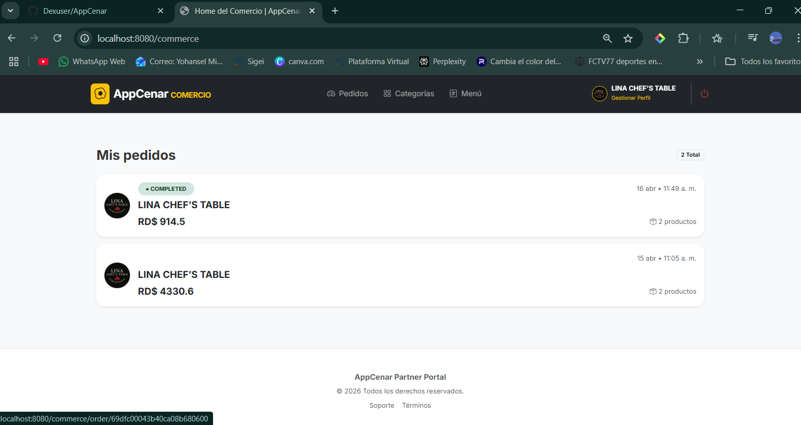
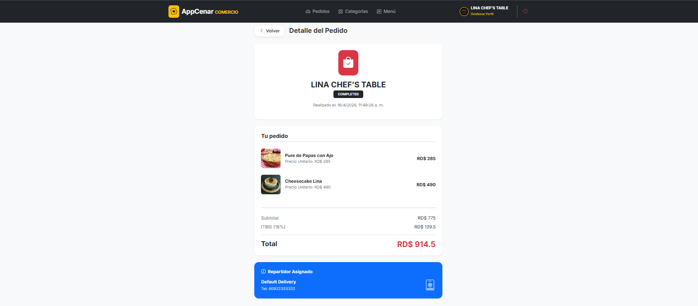
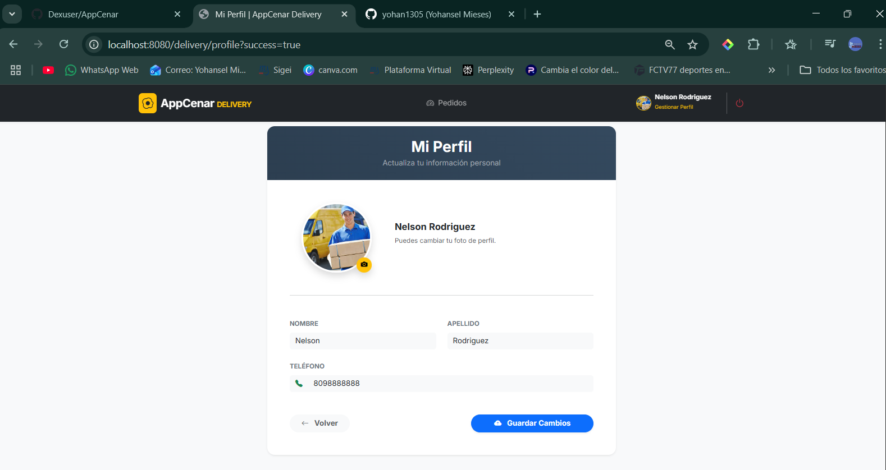

# AppCenar - Enterprise Food Delivery Ecosystem 🍔

**AppCenar** es una solución robusta de grado empresarial para la gestión de servicios de entrega de alimentos (Delivery). Esta plataforma Full-Stack, construida sobre **Node.js** y **Express**, resuelve la complejidad de conectar cuatro actores clave (Clientes, Comercios, Repartidores y Administradores) mediante una arquitectura de software avanzada que prioriza la seguridad, la persistencia de datos y el control de acceso granular.

⚙️ Core Business Logic & Roles
---
La plataforma implementa un control de acceso basado en roles (RBAC) con experiencias de usuario totalmente diferenciadas:

- **Módulo de Cliente:** Interfaz fluida para descubrimiento de comercios, gestión de favoritos, múltiples direcciones y trazabilidad de pedidos.
- **Panel de Comercio:** Suite operativa para la administración de catálogos, categorías y control de inventario en tiempo real.
- **Logística de Delivery:** Sistema de gestión de flotas para repartidores, con flujos de asignación y estados de entrega.
- **Administración Global:** Dashboard central para la supervisión de la red de comercios y auditoría de usuarios.

📂 Ingeniería de Software y Arquitectura
---
El proyecto destaca por una implementación técnica de alto nivel, utilizando patrones de diseño que garantizan la escalabilidad:

- **Middleware de Layout Dinámico:** Implementación de una lógica de servidor que detecta automáticamente el rol del usuario y asigna el entorno visual correspondiente (`admin-layout`, `client-layout`, etc.), optimizando la carga de vistas.
- **Seguridad y Sesiones:** Gestión robusta mediante **express-session** y **flash messages** para una comunicación efectiva de estados y errores sin comprometer la integridad del servidor.
- **Persistencia Avanzada con Mongoose:** Modelado de datos en **MongoDB** utilizando el patrón Singleton para la conexión y Schemas optimizados para un alto volumen de transacciones.
- **Validación del Lado del Servidor:** Capa de seguridad construida con **express-validator** para filtrar y sanear el 100% de la información entrante antes de su persistencia.
- **Helpers Personalizados en HBS:** Extensión de la lógica de las plantillas mediante helpers de comparación y secciones (`Equals`, `Section`), permitiendo una UI reactiva y lógica desde el servidor.

🔧 Stack Tecnológico & DevOps
---
- **Backend:** Node.js | Express.js.
- **Base de Datos:** MongoDB | Mongoose ORM.
- **Motor de Vistas:** Handlebars (HBS) con layouts dinámicos y arquitectura de parciales.
- **Control de Flujo:** Middleware personalizado para inyección de variables locales y validación de autenticación.
- **DevOps:** Configuración multi-entorno (**Development/QA**) mediante `dotenv` y `cross-env` para despliegues seguros y segregados.

📸 Galería del Proyecto
---
*Exploración visual de la arquitectura de interfaz y flujos operativos.*

* **Seguridad: Autenticación y Registro**
  

  

* **Experiencia de Usuario: Home del Cliente**
  

* **Gestión de Compra: Catálogo y Pedidos**
  

* **Operación de Negocio: Panel de Comercio**
  

* **Logística: Control de Entrega y Estados**
  

* **Gestión de Perfil: Repartidor y Direcciones**
  

## 👨‍💻 Lead Developers
* **Yohansel Mieses** – miesesyohansel@gmail.com
* **Luis Angel Ureña Perdomo** - 20241631@itla.edu.do
* **Johan guillen** - 20240108@itla.edu.do
